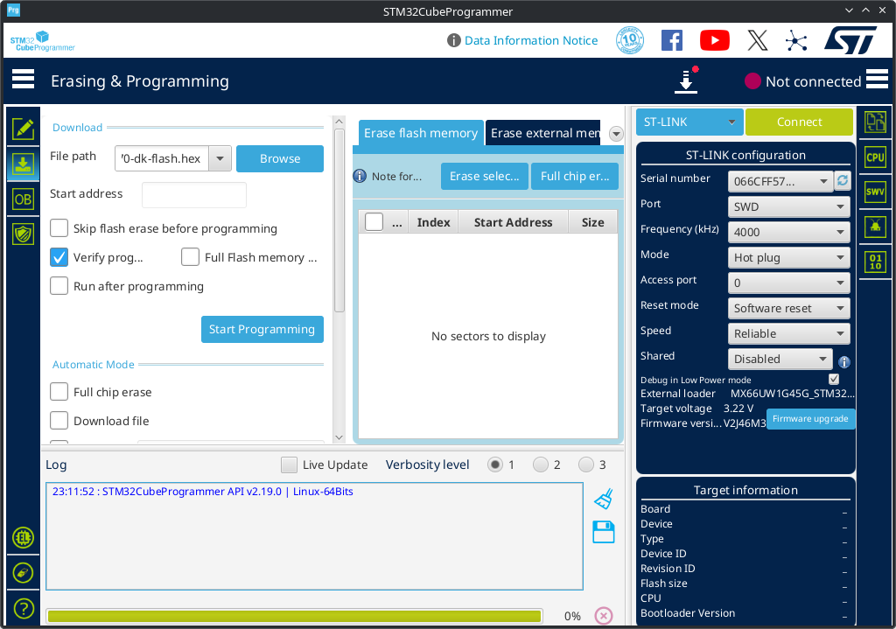

# damc_stm32
Use a 32F723EDISCOVERY or STM32N6570-DK eval board as a USB audio soundcard with parametric EQ, compressor and expander.

This project allow the use of an STM32 eval board as a soundcard with additional post processing.

The audio path is like this:

# Usage on 32F723EDISCOVERY

To do this, you must do the following:

- Flash this firmware to a [32F723EDISCOVERY eval board](https://www.st.com/en/evaluation-tools/32f723ediscovery.html):
  - With STLINK Mass storage drag'n drop:
    - Download [`damc_stm32-stm32f723disco-vX.Y.Z-stlink_dragdrop.zip`](https://github.com/amurzeau/usb_audio_loopback_stm32f723disco/releases)
    - Copy either `damc_stm32f723disco.hex` or `damc_stm32f723disco.bin` to the USB Mass storage device
    - This will flash your board
  - With [STM32CubeProgrammer](https://www.st.com/en/development-tools/stm32cubeprog.html#get-software):
    - Download [`damc_stm32-stm32f723disco-vX.Y.Z-stm32cubeprogrammer.zip`](https://github.com/amurzeau/usb_audio_loopback_stm32f723disco/releases)
    - Flash the board using [STM32CubeProgrammer](https://www.st.com/en/development-tools/stm32cubeprog.html#get-software) and `damc_stm32f723disco.elf`

- Power-up and connect the board using USB
  - Switch the power supply from STLINK USB cable to the USB HS cable by putting the jumper on USB HS on CN8 connector (under the board)
  - 
  - Connect a micro-USB cable to the USB HS connector of the eval board:
  - 

# Usage on STM32N6570-DK

- Flash this firmware to a [STM32N6570-DK eval board](https://www.st.com/en/evaluation-tools/stm32n6570-dk.html):
  - Open [STM32CubeProgrammer](https://www.st.com/en/development-tools/stm32cubeprog.html#get-software)
  - On the left, click `External Loaders` and enable the STM32N6570-DK `NOR-FLASH` loader (its name should be `MX66UW1G45G_STM32N6570-DK`).
  - 

  - In ST-LINK configuration on the right, select `Mode: Hot plug` and `Reset mode: Software Reset` (see above image)
  - On the board, select the DEV mode boot using BOOT0 and BOOT1 switches:
    - Put BOOT1 toward the outside of the PCB
    - Put BOOT0 toward the LCD screen
  - 

  - Connect to the board in STM32CubeProgrammer
  - On the left, click the second icon `Erasing & Programing`
  - In Download, File path, select the `damc_stm32n6570-dk-flash.hex` file
  - Click "Start Programm..." to flash the board
  - 
 

- Power-up and connect the board using USB
  - When programming is done, put the BOOT1 switch toward the LCD screen
  - 
  - Switch the power supply from STLINK USB cable to the USB-C cable by putting the jumper on `5V_USB_SNK` on JP2 connector (under the board)
  - 
  - Connect a USB-C cable to the USB1 connector of the eval board:
  - 

# General usage

- Download damc-gui for your platform (Windows 32 bits / 64 bits or Linux)
  - Run `damc_gui_serial.bat` to run `damc-gui` and control the board via its serial port
  - You should get something like this:
    

2 audio outputs and 1 audio inputs should appear in Windows.

The supported audio format is 48000 Hz, Stereo, 16 bits.

For each strip, audio is processed in this order:
- Equalizers
- Expander
- Compressor
- Volume
- Peak meter take the audio levels here
- Mute
